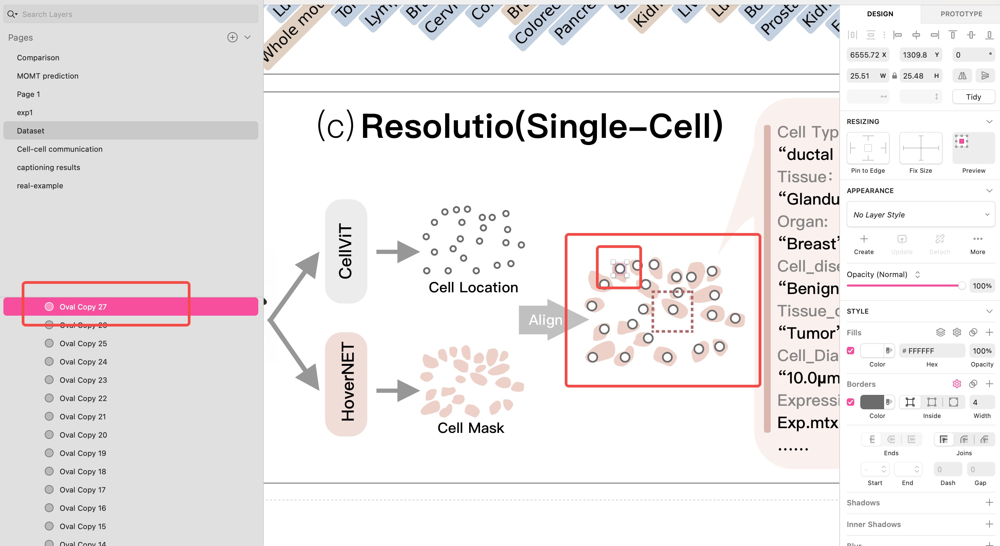
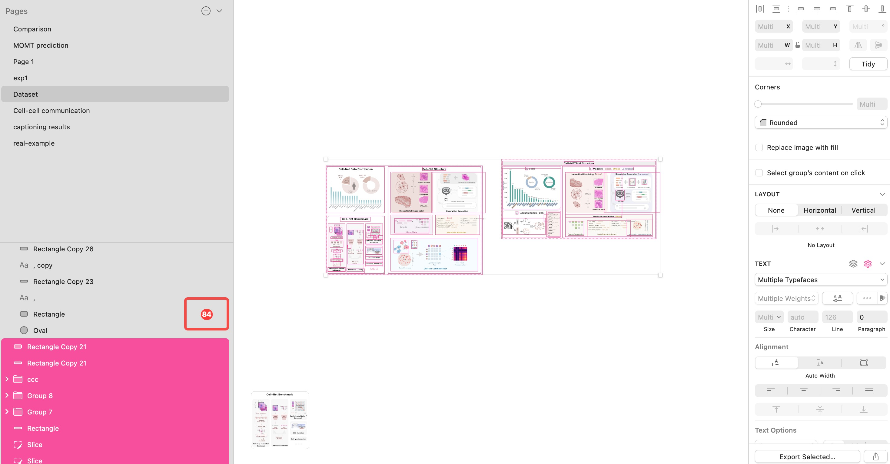

We thank the reviewer for identifying three places where our previous presentation was insufficiently precise: the distinction between native cell-resolved and derived cell-aligned molecular targets, the breadth of the experimental evaluation, and the evidence for what cell-level evaluation adds beyond spot-level prediction. We clarify these distinctions below, report the spatially separated native-Xenium, cross-sample, cross-organ, pseudo-spot, and assignment-audit results that are now available, and state the limitations that remain. We will also calibrate the title and claims and correct all presentation issues noted by the reviewer.

**Table 1. Per-organ native-cell breadth benchmark.** Leakage-controlled results on 30 H&E-aligned native-Xenium samples (360,000 cells) spanning 17 of the resource’s 25 organ categories and two species. Entries are sample-macro means on top-50 training-selected HVGs, using four contiguous spatial holdouts and a 5% train–test buffer.

| Organ label (species) | n samples | Image Gene P | Coordinate Gene P | Spatial KNN Gene P | Image Gene S | Image Cell P | Image F1 |
|---|---:|---:|---:|---:|---:|---:|---:|
| Bone (mouse) | 1 | 0.030 | **0.124** | 0.055 | 0.037 | 0.180 | 0.240 |
| Brain (human + mouse) | 2 | **0.399** | 0.010 | 0.036 | 0.371 | 0.570 | 0.752 |
| Breast (human) | 3 | **0.400** | 0.053 | 0.035 | 0.375 | 0.433 | 0.487 |
| Cervix (human) | 1 | **0.178** | 0.017 | 0.014 | 0.157 | 0.247 | 0.026 |
| Colon (mouse) | 1 | **0.615** | −0.137 | 0.072 | 0.588 | 0.739 | 0.744 |
| Colorectal (human) | 1 | **0.431** | 0.056 | 0.083 | 0.419 | 0.532 | 0.623 |
| Heart (human) | 1 | **0.292** | 0.010 | 0.021 | 0.266 | 0.688 | 0.304 |
| Kidney (human) | 1 | **0.402** | 0.019 | 0.017 | 0.361 | 0.471 | 0.460 |
| Liver (human) | 1 | −0.002 | 0.003 | **0.010** | −0.002 | 0.561 | 0.400 |
| Lung (human) | 3 | **0.359** | 0.065 | 0.053 | 0.317 | 0.402 | 0.457 |
| Lymph node (human) | 1 | **0.141** | 0.043 | 0.013 | 0.131 | 0.164 | 0.023 |
| Ovary (human) | 3 | **0.301** | 0.101 | 0.084 | 0.289 | 0.394 | 0.408 |
| Pancreas (human) | 3 | **0.340** | 0.087 | 0.073 | 0.299 | 0.484 | 0.451 |
| Prostate (human) | 1 | **0.263** | −0.015 | 0.025 | 0.244 | 0.263 | 0.083 |
| Skin (human) | 4 | **0.359** | 0.048 | 0.086 | 0.299 | 0.437 | 0.368 |
| Tonsil (human) | 1 | **0.294** | 0.028 | 0.018 | 0.249 | 0.462 | 0.399 |
| Whole pup (mouse) | 2 | **0.321** | 0.049 | 0.063 | 0.259 | 0.460 | 0.357 |
| **30-sample macro** | **30** | **0.324** | 0.046 | 0.053 | **0.291** | **0.442** | **0.413** |

*Brain combines one human and one mouse sample because the resource uses a shared organ label. Bold in the three Gene-Pearson columns marks the best of image, coordinate-only, and spatial KNN within each organ. Image leads both controls in 15/17 organ labels and 28/30 samples; liver and bone are retained as failures. The 30-sample image Gene Pearson is 0.202 on the top-200 HVGs and has a biological-sample bootstrap 95% CI of 0.277–0.368 on the top-50 HVGs. Training-mean Gene Pearson is undefined and is therefore not shown.*

**1. Figure 1 design and molecular-target provenance (P2, Q2, Q4, L1–L2, and the Figure 1 minor comment).**

**Figure 1 design provenance.** We appreciate the reviewer raising the possibility that Figure 1 was AI-generated, and we agree that its typographical errors and unfinished labels could have created that impression. We would nevertheless like to clarify the factual record: **Figure 1 was not AI-generated.** I designed and edited it manually in Sketch. The complete working file contains 84 editable layers. The first screenshot below exposes individual cell circles as separate “Oval” layers; the second preserves multiple Figure 1 versions and shows all 84 editable layers selected at once. Every circle, line, arrow, and layout element was placed manually. The figure underwent three separate revision rounds, with more than one week of cumulative design and editing time; it was not produced through a one-prompt generative workflow. The original-resolution evidence files and checksums are provided in the [anonymous artifact repository](https://anonymous.4open.science/r/sMMC-22M-DB75), under `figure1_design_evidence/`.

*Figure 1 construction evidence from the original Sketch workspace. The first screenshot exposes separately editable vector objects; the second shows multiple preserved versions and all 84 editable layers selected simultaneously.*

**AUTHOR INPUT REQUIRED:** reconnect and verify the anonymous repository URL above, and confirm that `figure1_design_evidence/` is visible before submission. The URL currently returns `not_connected`.

The care invested in this figure reflects why this resource is personally meaningful to me. I began assembling it during the first year of my PhD, when I was new to spatial transcriptomics. The data were fragmented across platforms, most available resources were still organized at the spot level, and working with individual datasets required learning different software stacks, from Scanpy-based workflows to Xenium Ranger and other platform-specific tools. I therefore started organizing the datasets I encountered into a consistent single-cell and cell-aligned collection. Over the following years, I continued this curation alongside my research. Across successive submission rounds, the collection grew from 12 million cells to 20 million and then to the 22-million-cell version submitted here; our rebuttal-time working manifest has since reached 28 million. It also expanded from Xenium-only data to Xenium plus Visium HD and, most recently, to a growing in-house DBiC-seq collection generated with our collaborators. Along the way, it has supported several of my published studies and many projects by my co-authors. Watching the resource mature has paralleled my own growth as a researcher and has exposed me to recurring challenges across platforms, resolution, and biological context. These experiences are why, as I approach graduation, I hope to make the resource broadly available soon in a unified, accessible form, particularly for students entering the field who face the same practical barriers that I did.

We provide this provenance to answer the factual concern while fully accepting the reviewer’s clarity criticism. We will correct “Hierarchical” and “Resolution (Single …),” complete the LLM-agent labels, and improve the layout and caption.

**Molecular-target provenance.** The premise that all source datasets provide only spot-level expression is not correct, although we agree that our presentation did not foreground the distinction sufficiently. The submitted public inventory contains 23,943,826 upstream/source records: 16,314,129 Xenium cells defined by platform-provided cell boundaries and transcript coordinates, and 7,629,697 Visium HD source/segmentation records. After bin-to-cell aggregation, the corresponding native-plus-derived expression matrices contain 20,246,169 target rows: 16,314,129 native Xenium cells and 3,932,040 derived Visium HD cell-aligned profiles. We will report these counting layers separately rather than calling every record a directly measured single cell.

**Native-cell validation under spatial separation.** We replaced the earlier random-cell diagnostic with a leakage-controlled evaluation of 30 H&E-aligned native-Xenium samples. The samples span 17 organ labels, 25 source-condition labels, and two species. We spatially stratified at most 12,000 cells per sample (360,000 cells in total), used four contiguous edge holdouts (x-high, x-low, y-high, and y-low), and removed a 5% coordinate-span buffer between the training and test regions. Target genes were selected using only each training partition. Frozen CONCH image features were evaluated with the same PCA–Ridge head against coordinate-only, eight-nearest-spatial-neighbor, and training-mean controls; Table 1 reports the primary result.

Image prediction exceeded both coordinate and spatial-neighbor controls in 15 of 17 organ labels and 28 of 30 samples; the two exceptions, human liver (image −0.002) and mouse bone (0.030), are retained rather than excluded. The paired sample-level image-versus-coordinate and image-versus-KNN comparisons remain significant after Holm correction (adjusted \(p\leq1.9\times10^{-8}\)). We do not perform a Gene-Pearson test against the constant training-mean predictor.

We also examined whether the moderate gene-wise correlations retain aggregate biological structure. On the overlap between training-selected HVGs and the available marker inventory, image Gene Pearson was 0.201. Using available expression-derived predicted cell-type labels to stratify test cells, the image-model pseudobulk RMSE was 0.120, compared with 0.187 for spatial KNN, 0.188 for the training mean, and 0.224 for coordinates. We treat this only as preliminary biological calibration, not independent cell-type validation: the labels are expression-derived, one sample lacks a usable annotation, and the mouse marker inventory must be re-aggregated with a species-specific list before a final marker table is reported.

Generalization remains endpoint-dependent. The same-organ top-50-HVG sample-held-out campaign reported in kUmZ-2 retains a positive transferable signal, whereas our earlier bidirectional **all-gene** UNI2-h tests in lung and ovary remain substantially less favorable: all-gene Pearson averages were −0.0003 and 0.0020, and coarse-state balanced accuracies were 0.139 and 0.159. Metadata-only baselines reached all-gene Pearson of 0.104 and 0.142 and balanced accuracy of 0.220 and 0.252. These results are not interchangeable: the former tests a training-selected variable-gene endpoint, whereas the latter tests the much harder full shared panel. We will report both and will not claim that current predictors solve unrestricted cross-sample expression recovery.

Accordingly, we will use “native cell-resolved” for Xenium, “derived cell-aligned” for Visium HD, and “toward cell-level prediction” for claims spanning both platforms. We will not imply that every target is an independently measured whole-transcriptome single-cell ground truth. A conservative revised title is *sMMC: A Cell-Aligned Multimodal Resource for Spatial Transcriptomics*.

**AUTHOR INPUT REQUIRED:** confirm the final title and audit every title/abstract use of “single-cell,” retaining it only for native measurements or appropriately qualified goals.

**2. Cross-organ evaluation and independent biological units (P3, Q1, P8 and L4).**

We agree that the previous manuscript did not clearly separate new primary acquisition from public aggregation and processing. Across three submission rounds, the resource grew from sMMC-12M to sMMC-20M, then to the submitted sMMC-22M manifest, and now to a rebuttal-time sMMC-28M working manifest. Table 2 separates mutually exclusive HEST-1K overlap, STimage-1K4M-only overlap, other public data, and new in-house primary data.

*Table 2. sMMC-28M working-manifest scale and provenance audit.*

| Category | Slides/samples | Organs or cell-line origins | Platforms | Aligned target cells after QC |
|---|---:|---|---|---:|
| **New in-house primary data** | **21** | **mouse-embryo; cervical; lung** | **DBiC-seq** | **53,989** |
| Public, overlapping HEST-1K | 32 unique slides (33 records) | 22 species–organ strata | Xenium; Visium HD | 11,051,149 |
| Public, overlapping STimage-1K4M only | 2 | 2 species–organ strata | Visium HD | 213,405 |
| Other public data | 44 | 16 species–organ strata | Xenium; Visium HD | 16,996,704 |
| **Total sMMC-28M** | **99 unique samples (100 records)** | **25 tissue strata + 3 cell-line origins** | **Xenium; Visium HD; DBiC-seq** | **28,315,247** |

The 21 in-house samples contain 54,304 measured cells; final paired-record QC removes 315 cells, leaving 53,989 aligned targets. Most of the overall scale comes from public aggregation and harmonization, and we will state that explicitly. However, the new primary component is a growing in-house DBiC-seq collection with paired morphology, RNA, and cellular context. Acquisition has continued since submission; the broader pool now contains approximately 200,000 paired cells and will be reported separately in the final manifest with exact sample/cell counts, checksums, and fractions.

To answer Q1 directly, **the earlier main experiments were not trained and tested across all 25 organ categories under one matched protocol**; the manuscript was ambiguous on this point. Table 1 now gives per-organ performance for the 17 categories with H&E-aligned native-Xenium samples in the leakage-controlled campaign, increasing the explicit native-cell breadth from the three representative organs emphasized previously to 17. Tables 3–4 separately report eight-organ Visium HD evaluations. These evidence sets overlap and should not be combined to imply an all-25 benchmark. We will distinguish release-wide organ coverage from protocol-specific evaluation support in the main text and manifest, and will not report performance for an unsupported category.

We additionally performed a native-Xenium same-organ leave-one-sample-out evaluation on 18 target samples from human breast, lung, ovary, pancreas, and skin and mouse whole pup. For each target, all other available samples from the same species–organ group formed the training set; the complete target sample was held out, and the top 50 variable genes were selected from training data only. Frozen CONCH/PCA–Ridge achieved mean Gene Pearson 0.170 (range 0.016–0.372 across targets). Mean Cell Pearson was 0.275 versus 0.205 for the training-mean control, with image prediction higher in 14/18 targets; mean F1 was 0.125 versus 0.031, with image prediction higher in 17/18. The training-mean Gene Pearson is not reported because a constant prediction makes that correlation undefined. This is a **sample-held-out**, not donor-held-out, result; it supports transferable signal for a restricted training-selected endpoint but not unrestricted patient-level generalization.

We also agree that the main text emphasized representative organs without a compact cross-organ summary. We therefore report the in-domain and cross-patient results together below. Table 3 is the same-sample, spatially held-out in-domain comparison of STBoosted BLEEP, GHIST, sCellST, and STBoost-Ref across eight organs. Table 4 uses a separate source sample and target sample for each organ under a matched transfer protocol.

*Table 3. Eight-organ in-domain cell-level comparison. BL denotes STBoosted BLEEP (the published BLEEP architecture retrained under the same cell-aligned protocol); GH and SC denote GHIST and sCellST, respectively. Bold marks the best result within each organ and metric.*

| Organ | Gene P BL | Gene P GH | Gene P SC | Gene P STBoost-Ref | Gene S BL | Gene S GH | Gene S SC | Gene S STBoost-Ref | Cell P BL | Cell P GH | Cell P SC | Cell P STBoost-Ref |
|---|---:|---:|---:|---:|---:|---:|---:|---:|---:|---:|---:|---:|
| Human ovary | 0.4239 | 0.4523 | 0.0800 | **0.6451** | 0.4396 | 0.4813 | 0.0640 | **0.6049** | 0.8212 | 0.7382 | 0.6858 | **0.8379** |
| Human lung | 0.4241 | 0.4754 | 0.1255 | **0.5178** | 0.4310 | 0.4814 | 0.1748 | **0.5077** | 0.5622 | 0.5787 | 0.4704 | **0.6042** |
| Human breast | 0.0079 | 0.0487 | 0.0032 | **0.5118** | 0.0051 | 0.0495 | 0.0070 | **0.5849** | 0.1282 | 0.1832 | 0.1240 | **0.5465** |
| Mouse kidney | 0.3356 | 0.3040 | 0.0236 | **0.3643** | **0.3468** | 0.2781 | 0.0264 | 0.3313 | **0.5369** | 0.5285 | 0.2601 | 0.5112 |
| Human tonsil | 0.1809 | 0.1591 | 0.0088 | **0.3817** | 0.1794 | 0.1488 | 0.0084 | **0.3354** | 0.7808 | 0.6107 | 0.7199 | **0.8193** |
| Human pancreas | 0.2147 | 0.2692 | 0.0513 | **0.4926** | 0.2035 | 0.2411 | 0.0427 | **0.4682** | 0.6143 | 0.5826 | 0.4371 | **0.7258** |
| Mouse brain | 0.2864 | 0.2417 | 0.0395 | **0.3972** | 0.2719 | 0.2253 | 0.0318 | **0.3765** | 0.4827 | 0.4691 | 0.2945 | **0.5536** |
| Mouse embryo | 0.2431 | 0.2105 | 0.0174 | **0.3489** | 0.2286 | 0.1964 | 0.0132 | **0.3207** | 0.4519 | 0.4273 | 0.2368 | **0.5084** |

*Table 4. Eight-organ cross-patient Visium HD benchmark, implemented as source-sample-to-target-sample transfer. TM is the training-mean baseline; its gene-wise Pearson is undefined because its prediction is constant across test cells.*

| Organ | Pair | UNI2-h Gene P | UNI2-h Cell P | UNI2-h F1 | TM Cell P | TM F1 |
|---|---|---:|---:|---:|---:|---:|
| Human breast | j→m | 0.0272 | 0.1109 | 0.1794 | 0.1108 | 0.1215 |
| Human ovary | ad→ak | 0.0267 | 0.4593 | 0.1161 | 0.4906 | 0.0561 |
| Human lung | k→d | 0.0143 | 0.2121 | 0.0960 | 0.1455 | 0.0236 |
| Human pancreas | g→ag | 0.0040 | 0.0090 | 0.0389 | 0.0023 | 0.0168 |
| Human tonsil | u→i | 0.0141 | 0.2769 | 0.0708 | 0.3264 | 0.0346 |
| Mouse brain | e→ah | 0.0243 | 0.2016 | 0.0623 | 0.2238 | 0.0179 |
| Mouse embryo | b→ai | 0.0048 | 0.0913 | 0.0369 | 0.1683 | 0.0134 |
| Mouse kidney | a→aj | 0.0049 | 0.2678 | 0.0513 | 0.4696 | 0.0159 |
| **Organ-macro mean** | — | **0.0151** | **0.2036** | **0.0815** | **0.2422** | **0.0375** |

The cross-patient table uses a frozen UNI2-h encoder, seed 42, 20,000 source-reference cells, 2,000 validation cells, at most 5,000 target-test cells, five epochs, all shared genes, and an identical training-mean baseline. Every organ uses 5,000 target-test cells.

The contrast is clear. In-domain, STBoost-Ref is best in 22 of 24 organ–metric comparisons; the two exceptions are kidney gene Spearman and kidney cell Pearson, where STBoosted BLEEP is best. Cross-patient transfer is much harder. UNI2-h improves organ-macro F1 over the training-mean baseline (0.0815 versus 0.0375) and produces nonzero gene-wise correlation, but it does not beat that baseline in macro cell Pearson (0.2036 versus 0.2422). Its cross-patient gene Pearson ranges from 0.0040 (pancreas) to 0.0272 (breast), cell Pearson from 0.0090 (pancreas) to 0.4593 (ovary), and F1 from 0.0369 (embryo) to 0.1794 (breast).

We do not hide this negative result or claim that the current predictor solves cross-patient generalization. The same construction, preprocessing, and target QC support the in-domain and transfer protocols, so this performance drop should not by itself be interpreted as evidence that the resource is invalid. Rather, it exposes a central unsolved problem: morphology, cell-state composition, acquisition conditions, and molecular distributions can change substantially across patients, and cross-platform transfer introduces an additional shift. Such patient and platform biases are also well recognized in single-cell analysis. We currently do not have a method that removes these shifts reliably. An important purpose of this resource is therefore to make the failure measurable across organs and to enable future work to develop stronger patient- and platform-robust methods.

The scale table reports 99 unique source samples, but “sample” is not interchangeable with “donor.” The eight-organ experiment uses eight distinct source–target sample pairs (16 source samples). Table 4 uses “cross-patient” to match the manuscript’s task terminology, but operationally the current audit verifies a sample-held-out split; we will call it patient-held-out only where donor identity is verified. The revised manifest will report patient/donor/animal, specimen, and section support and keep repeated sections from one biological subject in the same split.

**AUTHOR INPUT REQUIRED:** insert verified human donor/patient and animal totals and per-organ grouping from source metadata; do not infer missing identities.

**3. Why cell-level evaluation matters (P4, Q3 and L3).**

We agree that a direct comparison is needed, but higher raw correlation at cell level is not the correct success criterion. Spot averaging reduces biological and measurement variance and therefore generally makes prediction numerically easier. The relevant question is whether averaging conceals within-region cellular heterogeneity that cell-level evaluation can detect.

We therefore completed a matched native-Xenium analysis on six samples. Within each sample, the cell-level and 8, 16, and 55 \(\mu\mathrm{m}\) pseudo-spot predictors used the same contiguous spatial holdouts, training-selected top-50 HVGs, frozen CONCH features, and PCA–Ridge head. For a pseudo-spot predictor, cell expression and image embeddings were averaged within each spatial grid during training; the resulting spot prediction was then broadcast to its constituent test cells so that every resolution was evaluated against the same native-cell targets.

| Supervision/evaluation resolution | Gene Pearson |
|---|---:|
| Native cell | **0.365** |
| 8 \(\mu\mathrm{m}\) pseudo-spot | 0.365 |
| 16 \(\mu\mathrm{m}\) pseudo-spot | 0.363 |
| 55 \(\mu\mathrm{m}\) pseudo-spot | 0.330 |

All six samples decreased at 55 \(\mu\mathrm{m}\), but the magnitude was density-dependent: mouse brain FFMB028 decreased from 0.467 to 0.355 and lung HLCX022 from 0.318 to 0.261, whereas mouse whole pup WMPP017 changed only from 0.397 to 0.392. In the full-density HLCX022 audit, 55-\(\mu\mathrm{m}\) grids mixed cell-type labels in 55.5–66.4% of test spots and affected 73.8–81.0% of test cells across the four spatial holdouts; the corresponding HHDX011 values were only 3.5–4.1% and 7.0–8.3%. Thus, coarse aggregation can produce substantial mixing and oversmoothing in dense heterogeneous tissue, while providing little change in sparse tissue.

This result does not show that cell-level prediction is universally more accurate. Moreover, the present pseudo-spot image representation averages constituent cell embeddings rather than using a newly extracted spot-centered crop. We therefore restrict the conclusion to density-dependent target mixing and loss of cell-level discrimination, and we will not claim a universal cell-over-spot accuracy advantage.

**4. Cell localization, expression assignment, and quality control (P6 and Q4).**

For Xenium, we use platform-provided cell boundaries and transcript coordinates. For Visium HD, we apply the official spatial transform to register the native bin grid to histology, obtain H&E cell footprints using CellViT, and aggregate bin counts over cell footprints. In the audited implementation, a closed native $2\,\mu\mathrm{m}$ bin square is assigned when it intersects a polygon. If more than one cell claims a bin, the nearest CellViT centroid in full-resolution coordinates wins; an exact tie uses the lower raw-cell index. We will state these rules, registration, segmentation, and QC separately by platform before the experiments.

We tested the default rule, strict exclusion of all boundary-touching bins, one-bin mask erosion, and one-bin dilation on lung A, lung B, and ovary. Their default assignments contained 126,629, 162,215, and 82,174 cells, respectively, with 1,650,497, 2,007,114, and 1,366,939 assigned bins. Strict-interior assignment retained 62.5%, 56.1%, and 80.7% of cells but only 16.0%, 11.0%, and 20.5% of bins; erosion retained 46.0%, 37.9%, and 72.0% of cells. Dilation retained essentially all cells and increased assigned bins to 184.4%, 196.2%, and 181.9% of default. These results reveal material boundary sensitivity; they do not yet justify a robustness claim. We will therefore expose assignment settings and report sensitivity rather than treating the default aggregation as ground truth.

As a complementary audit, we uniformly reservoir-sampled 3,000 CellViT polygons from each of three Visium HD datasets and tested their overlap with the available filtered native \(2\,\mu\mathrm{m}\) bins under 1-\(\mu\mathrm{m}\) erosion, dilation, and x/y shifts.

| Dataset | Polygons with no intersecting filtered bins | Median bins among assigned cells | x-shift bin Jaccard | x-shift expression cosine |
|---|---:|---:|---:|---:|
| Human lung cancer (`d`) | 50.6% | 12 | 0.727 | 0.954 |
| Mouse brain (`e`) | 2.5% | 24 | 0.806 | 0.936 |
| Human pancreas (`g`) | 50.0% | 9 | 0.706 | 0.994 |

The high cosine among successfully matched profiles does not cancel the selection problem that approximately half of the sampled lung and pancreas polygons intersected no filtered bins. Conversely, the mouse-brain result shows that this failure rate is not universal. This complementary audit is polygon-wise and does not reproduce competition when multiple polygons claim the same bin; it therefore cannot validate the full conflict-resolution pipeline. We will expose per-sample assignment coverage and perturbation QC and retain native Xenium and derived Visium HD evidence as separate categories.

**AUTHOR INPUT REQUIRED:** verify the CellViT and registration versions, QC thresholds, and segmentation/centroid consistency statistics.

**5. Scope of the context analysis and demographic metadata (P4 and P9).**

We agree that the ovarian experiment neither validates molecular single-cell resolution nor supports a causal age claim. Its narrower purpose is to show a metadata-defined transfer failure hidden by pooled evaluation. Comparing AK (60+)→AD (60+) with AK (60+)→AL (40−), F1 decreases from 0.289 to 0.072, gene Spearman from 0.036 to 0.006, cell Spearman from 0.206 to 0.095, and predicted nonzero rate from 0.166 to 0.027. Because age is nested within sample/patient and tissue context and the panels differ, we will rename this a *sample/age-confounded context shift*, not an age effect, and use it only to motivate Average, Worst-context, Gap, and Support reporting.

To test whether this was an isolated example, we applied the same Average/Worst/Gap audit to frozen biomedical encoders in complementary context-rich public cohorts:

| Domain | Task / encoder | Context; split | Avg. BA | Worst BA | Gap |
|---|---|---|---:|---:|---:|
| Single-cell | Bone marrow / Geneformer | assay; patient-CV | 0.938 | 0.669 | 0.327 |
| Single-cell | Bone marrow / scGPT | assay; patient-CV | 0.962 | 0.740 | 0.258 |
| Single-cell | Bone marrow / scVI-style | assay; patient-CV | 0.932 | 0.616 | 0.373 |
| Single-cell | Ten tissues / scGPT | dataset; patient-CV | 0.667–0.962 | 0.004–0.892 | max 0.975 |
| Pathology | LUAD KRAS / CONCH | site; leave-one-site | 0.499 | 0.375 | 0.542 |
| Pathology | LGG IDH / UNI | site; leave-one-site | 0.682 | 0.464 | 0.471 |
| Pathology | LGG IDH / H-Optimus-0 | site; leave-one-site | 0.747 | 0.476 | 0.524 |

BA is balanced accuracy; Gap is best-to-worst context, not Average minus Worst. High averages coexist with collapse: scGPT reaches Worst BA 0.004, and site gaps for CONCH, UNI, and H-Optimus-0 are 0.471–0.542. Thus, the ovarian result is an sMMC example of a recurring cross-modal problem. Context-aware metadata enable Average/Worst/Gap/Support audits; they do not by themselves remove bias.

Our manifest audit also shows that donor/patient identity, age, sex, and disease are not consistently documented across source studies, and ethnicity is absent or undocumented in the current source manifests. We will report coverage and missingness rather than infer sensitive attributes from images or names, remove the statement that no demographic bias is anticipated, and stratify performance only where independent-donor support and consent permit responsible analysis.

**PENDING EXPERIMENT:** rerun the ovarian comparison on one shared gene panel with matched preprocessing and uncertainty; add the source-reported context coverage/missingness table and only sufficiently supported subgroup analyses.

**6. Terminology, figures, and presentation (P5, P7 and minor comments).**

We will define STBoost at first use as the model-agnostic cell-aligned data interface. BLEEP is the published spot-level image–expression contrastive retrieval baseline. STBoosted BLEEP is BLEEP retrained through this interface, whereas STBoost-Ref is our native image-only, retrieval-based reference predictor. To remove the ambiguity noted by the reviewer, we eliminate the bare “Ours” label and use STBoost-Ref explicitly in Table 3, figures, and prose. At inference, STBoost-Ref receives local and wider-context histology crops, never query expression, and returns a cell-aligned expression vector.

The Figure 1 design provenance and planned corrections are addressed first in kUmZ-1. For the remaining presentation issues, we will remove the Figure 3 border, export figure text as vector elements, define “study split,” “cell unit,” and Figure 2’s training ratio, remove the identified redundant framing text, correct all typographical and citation/link issues, and state precisely which data, metadata, and processed artifacts are released. The revised limitations will state that within-sample results may exploit spatial autocorrelation, sample-held-out tests expose but do not solve acquisition and biological shifts, native Xenium and derived Visium HD targets have different evidentiary status, boundary assignment propagates uncertainty, metadata coverage is uneven, and predictions are not substitutes for molecular measurement.

**Closing.** In summary, the revised framing will distinguish native Xenium measurements from derived Visium HD targets, support breadth claims with per-organ and independent-sample results, and ground the value of cell-level evaluation in direct cell-versus-spot evidence rather than terminology alone.
